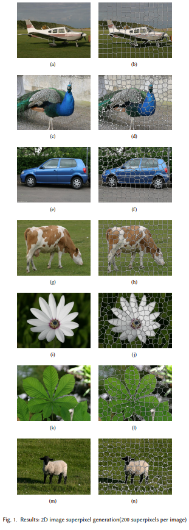
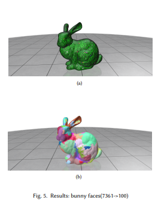

## The-application-of-K-Means-Clustering

​	In this project, we implement two algorithms both for 2D and 3D cases based on the K-Means algorithm. 	For 2D case, we implement efficient 2D superpixels generation algorithm with reference to SLIC Superpixels Compared to State-of-the-Art Superpixel Methods. 

​	For 3D case, we implement 3D mesh simplification algorithm with reference to variational shape approximation.

## Run

### 2D superpixels generation algorithm

```bash
cd 2D-superpixels-generation-algorithm
mkdir build
cd build
cmake ..
cmake --build . --config Realease -j
main.exe -i data/dog.JPG -s 200 -c 20
main.exe -i spcount/flower.JPG -s 2000 -c 20
main.exe -i compactness/flower.JPG -s 200 -c 100
```

### 3D mesh simplification algorithm

```bash
cd 3D-mesh-simplification-algorithm
mkdir build
cd build
cmake ..
cmake --build . --config Realease -j
# bunny 7361 faces
python k-means.py --path assets/bunny.obj --nbProxys 100 
# arm 98624 faces
python k-means.py --path assets/arm.obj --nbProxys 100 
# bubble 1280 faces
python k-means.py --path assets/bubble.obj --nbProxys 100 
# chess_piece 42684 faces
python k-means.py --path assets/chess_piece.obj --nbProxys 100
# ear 710 faces
python k-means.py --path assets/ear.obj --nbProxys 100
# vase 1504 faces
python k-means.py --path assets/vase.obj --nbProxys 100
```

## Results



